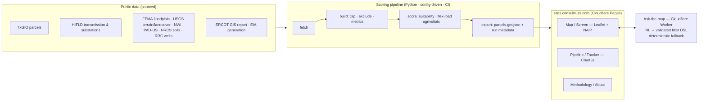

# South Texas Site Screen & Land-Control Tracker

**Live:** [sites.consultruss.com](https://sites.consultruss.com) · **By:** [Russell W. Hild](https://consultruss.com) · **License:** MIT

A working tool that screens South Texas land for renewable / data-center suitability and tracks candidate parcels through site control — the two halves of early-stage energy land development, in one clickable map.

> **What this is, honestly.** A reference demonstration over **public** South Texas data, distilled from how I evaluate sites in practice. The geospatial and infrastructure layers are **real and sourced**; ownership names and the deal pipeline are **synthetic**, for demonstration. I trained in ArcGIS/ESRI during my Master of Real Estate at Texas A&M and **re-sharpened hands-on in QGIS** to build this — open-source, brand-agnostic, and translatable to ArcGIS Pro and Google Earth. The methodology, not the tool, is the point.

---

## Why I built it

Early-stage energy development comes down to two questions, asked thousands of times across a region: **which land is worth pursuing, and where does each parcel stand on the way to site control?** The first is a GIS problem; the second is a data-and-reporting problem. I do both kinds of work, so I built one tool that does both — anchored on **Wilson and Karnes counties** in the Eagle Ford, southeast of San Antonio, in the heart of the ERCOT large-load buildout.

This isn't a thought experiment. San Antonio's data-center load is on track toward 3,300+ MW by 2033, CPS Energy is spending upwards of $1.3B on transmission to keep up, and an hour up the road Rockdale turned a bitcoin mine into an AI data center that throttles back near-instantly — curtailing 95%+ of its load — when the grid needs it. Interconnection-aware land screening is the live problem here. This tool is how I'd approach it.

## What it does

**1 · Screen.** Every rural parcel ≥ 50 acres in the study area is scored against a multi-criteria suitability model — interconnection proximity (distance to ≥138 kV substations and lines), buildable acreage after constraint exclusions (floodplain, wetlands, protected land, plus Eagle Ford wellbore and pipeline setbacks), terrain, land cover and soil capability class, and road access — then ranked. Click any parcel for the full breakdown.

**2 · Track.** A site-control pipeline view follows a shortlist of parcels from *identified* to *title cleared* — status funnel, acreage and cost by stage, budget burn, and title/survey issue flags — with each row linked to its parcel on the map. (The Power-BI-style tracker, built in open tooling and hosted live.)

**3 · Ask the map.** Type a question in plain English — *"parcels over 200 buildable acres within 2 miles of a 138 kV+ substation, no floodplain"* — and the map filters. Natural language in, sited land out.

**4 · Two analytical lenses.** Toggle between siting for **flexible/large load** (interconnection headroom, proximity to generation, demand-response value) and **whole-site dual use** (agrivoltaics — grazing compatibility, pollinator habitat, soil-and-water stewardship). Two ways of valuing the same ground.

## Architecture



Static-first: the pipeline produces a single scored GeoJSON the web app reads directly. The only backend is a thin Cloudflare Worker that translates natural-language questions into a validated filter — it never touches the data and falls back to a rule-based parser if needed, so the tool works for anyone with zero setup.

## Data sources

All public, all cited with retrieval dates in [`data/SOURCES.md`](data/SOURCES.md). Parcels: TxGIO (Texas Geographic Information Office) StratMap. Transmission & substations: HIFLD. Floodplain: FEMA NFHL. Terrain & land cover: USGS 3DEP / NLCD. Soils & farmland class: USDA-NRCS SSURGO. Wetlands & protected land: USFWS NWI, USGS PAD-US. Oil/gas wells & pipelines: Texas Railroad Commission. Generation & interconnection context: ERCOT GIS Report, EIA. Imagery: USDA NAIP. *No MLS/IDX data is used; restricted ERCOT model data is abstracted, never displayed raw.*

## Methodology

The suitability model is a transparent weighted overlay; the default weights are published in [`config.yaml`](config.yaml) and explained in the About view. They're illustrative and tunable — the point is the approach: normalize each criterion 0–100, weight, sum, rank, and always lead with interconnection, because in ERCOT that's the constraint that kills or makes a site.

## Quickstart

```bash
# Regenerate the scored dataset from public sources
python -m pipeline run --config config.yaml
# Serve the web app locally
cd web && python -m http.server 8000
```

Full setup, the Worker config, and the eval suite are documented in [`docs/`](docs/).

---

*Built by Russell W. Hild — land & real estate professional (Texas A&M Master of Real Estate, Land Economics) who builds and runs his own data systems. Reference implementation distilled from how I work; data is public and synthetic as noted above.*
